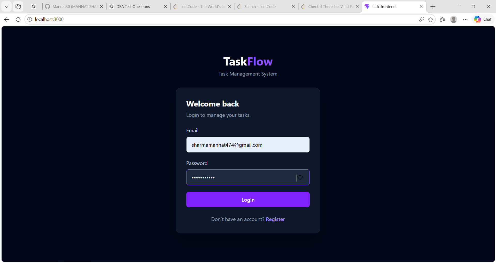
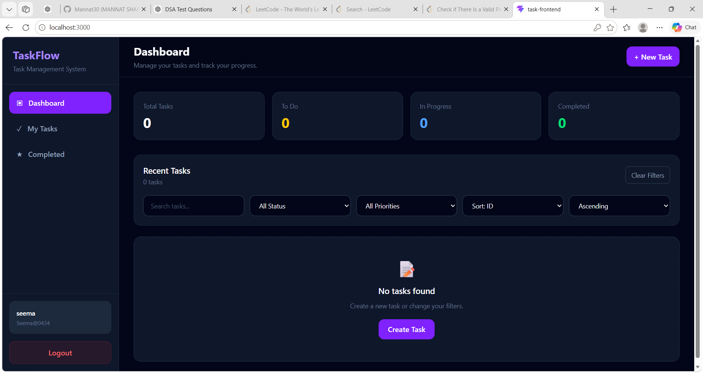
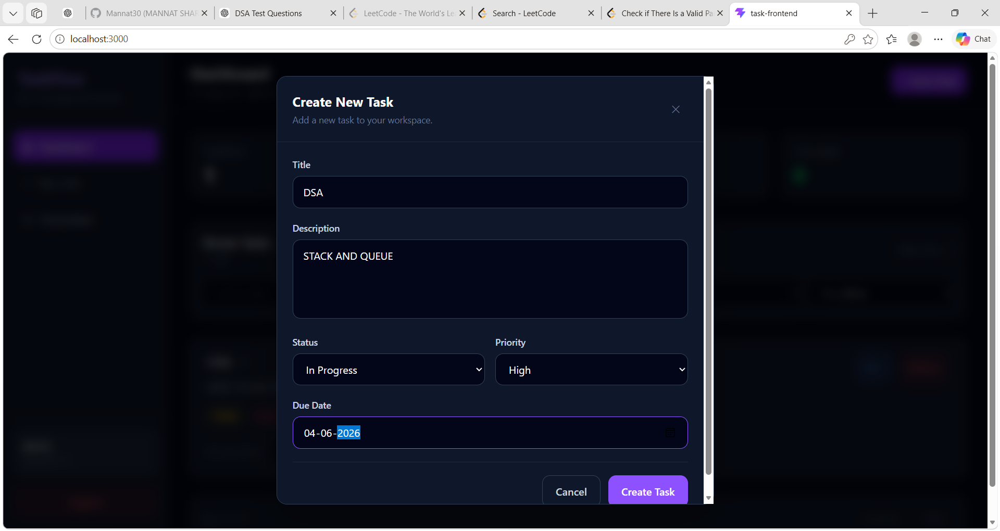

# 🚀 TaskFlow — Task Management System

TaskFlow is a full-stack Task Management System built using **Spring Boot and React**.  
It provides secure JWT-based authentication, task CRUD operations, searching, filtering, sorting, pagination, dashboard statistics, and role-based admin management.

The application is also **Dockerized**, allowing the complete system to run locally using Docker Compose.

---

## 📸 Screenshots

### 🔐 Login



### 📊 Dashboard



### ➕ Create New Task



### ✏️ After Task Update


---

## ✨ Features

### 🔐 Authentication & Security

- User registration
- User login
- JWT-based authentication
- BCrypt password encryption
- Role-based authorization
- USER and ADMIN roles
- Protected API endpoints
- Stateless authentication

### 📋 Task Management

- Create tasks
- View tasks
- Update tasks
- Delete tasks
- View individual tasks
- Task status management
- Task priority management
- Due dates
- User-specific tasks

### 🔎 Search & Filtering

- Search tasks by title
- Filter by status
- Filter by priority
- Combine search and filters

### 📊 Sorting & Pagination

- Sort tasks by different fields
- Ascending and descending sorting
- Server-side pagination
- Configurable page size

### 📈 Dashboard

The dashboard provides task statistics including:

- Total tasks
- To Do tasks
- In Progress tasks
- Completed tasks

### 👨‍💼 Admin Management

Administrators can:

- View users
- Delete users
- Update user roles

### 🐳 Docker

The application is containerized using Docker.

Docker Compose runs:

- React frontend
- Spring Boot backend
- MySQL database

---

# 🛠️ Tech Stack

## Backend

- Java 25
- Spring Boot 4.1.1
- Spring Data JPA
- Spring Security
- JWT
- Hibernate
- Maven
- MySQL
- Jakarta Validation

## Frontend

- React
- Vite
- JavaScript
- Axios
- Tailwind CSS

## DevOps / Deployment

- Docker
- Docker Compose
- Nginx

---

# 🏗️ Architecture

```text
                    ┌─────────────────────┐
                    │      React UI       │
                    │   Vite + Tailwind   │
                    └──────────┬──────────┘
                               │
                               │ REST API
                               ▼
                    ┌─────────────────────┐
                    │    Spring Boot      │
                    │      Backend        │
                    ├─────────────────────┤
                    │ Controllers          │
                    │ Services             │
                    │ Repositories         │
                    │ Spring Security      │
                    │ JWT Authentication   │
                    └──────────┬──────────┘
                               │
                               │ JPA / Hibernate
                               ▼
                    ┌─────────────────────┐
                    │       MySQL         │
                    │      Database       │
                    └─────────────────────┘
